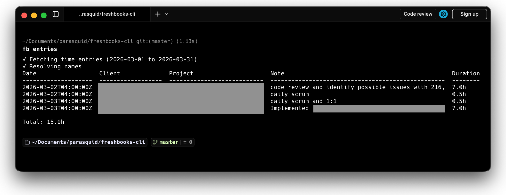

# FreshBooks CLI (`fb`) 

A command-line tool for managing FreshBooks time tracking. Supports OAuth2 authentication, interactive time logging with remembered defaults, entry listings, client/project/service browsing, hours summaries, and inline editing and deletion of entries.



## Install

### Docker (no Ruby required)

```bash
git clone <repo-url> && cd freshbooks-cli
./fb auth
```

The `./fb` wrapper script runs the CLI inside a Docker container. Data persists in `.fb/` in the project directory.

### RubyGems

```bash
gem install freshbooks-cli
fb auth
```

### Ruby gem (from source)

```bash
gem build fb.gemspec
gem install freshbooks-cli-*.gem
fb auth
```

Both install `fb` to your PATH — runs natively, no Docker involved. Data stored in `~/.fb/`.

## Setup

Running any command for the first time triggers setup:

1. Create a FreshBooks app at https://my.freshbooks.com/#/developer
2. Set the redirect URI to `https://localhost`
3. Enable these scopes:
   - `user:profile:read` — discover business/account IDs (enabled by default)
   - `user:clients:read` — list clients for selection
   - `user:projects:read` — list projects for selection
   - `user:billable_items:read` — list services for selection
   - `user:time_entries:read` — list time entries
   - `user:time_entries:write` — create time entries
4. Enter your Client ID and Client Secret when prompted
5. Complete the OAuth flow — your `business_id` and `account_id` are auto-discovered

All data is stored in `~/.fb/` (or `.fb/` in the project directory when using Docker).

## Interactive vs Non-interactive Mode

The CLI auto-detects whether it's running in a terminal:

- **Interactive** (`$stdin.tty?` is true): Prompts for missing values, shows selection menus
- **Non-interactive** (piped input, agents, CI): Never prompts — uses flags, sane defaults, or aborts with clear errors

You can force non-interactive mode with `--no-interactive`.

**Non-interactive defaults:**
- Single client/project → auto-selected
- Multiple clients without `--client` → aborts with list of available clients
- Missing `--duration` or `--note` → aborts with "Missing required flag"
- `--date` → defaults to today
- Project/service → optional, auto-selected if single

## Commands

### `fb auth`

Authenticate with FreshBooks. When run interactively (no subcommand), walks through the full OAuth flow.

```
$ fb auth
Open this URL in your browser:
  https://auth.freshbooks.com/oauth/authorize?client_id=...
Paste the redirect URL: https://localhost?code=abc123
Authentication successful!
Business: Acme Inc
```

#### Auth subcommands (for agents/scripts)

```bash
# Save OAuth credentials — set env vars first, then run setup
export FRESHBOOKS_CLIENT_ID=YOUR_ID
export FRESHBOOKS_CLIENT_SECRET=YOUR_SECRET
fb auth setup

# Or use a .env file (recommended — keeps secrets out of shell history)
cp .env.example ~/.fb/.env   # edit with your credentials
fb auth setup

# Get the authorization URL
fb auth url                    # prints URL to stdout
fb auth url --format json      # {"url": "..."}

# Exchange OAuth code after user authorizes
fb auth callback "https://localhost?code=abc123"
# Single business: auto-selected
# Multiple businesses: prints list, use `fb business --select ID`

# Check current auth state
fb auth status                 # human-readable
fb auth status --format json   # structured output
```

Tokens auto-refresh before every API call — no need to re-auth unless you revoke app access.

### `fb business`

List or select the active business. Required when your FreshBooks account has multiple businesses.

```bash
fb business                    # List all businesses (marks active)
fb business --format json      # JSON output
fb business --select ID        # Set active business by ID
fb business --select           # Interactive picker
```

### `fb log`

Log a time entry. Interactive by default — walks you through selecting a client, project, service, date, duration, and note. Remembers your last selections as defaults.

```
$ fb log

Clients:

  1. Acme Corp [default]
  2. Globex Inc

Select client (1-2) [1]:

Projects:

  1. Website Redesign [default]

Select project (1-1, Enter to skip) [1]:

Date [2026-03-03]:
Duration (hours): 2.5
Note: Built API endpoints

--- Time Entry Summary ---
  Client:   Acme Corp
  Project:  Website Redesign
  Date:     2026-03-03
  Duration: 2.5h
  Note:     Built API endpoints
--------------------------

Submit? (Y/n):
Time entry created!
```

**Non-interactive mode** — pass flags to skip prompts:

```bash
fb log --client "Acme Corp" --project "Website Redesign" --service "Development" --duration 2.5 --note "Built API endpoints" --yes
fb log --client "Acme Corp" --duration 2.5 --note "Work" --yes --format json  # JSON output with entry ID
```

**Note:** Services are project-scoped. Use `fb projects --format json` to see available services per project.

### `fb entries`

List time entries. Defaults to the current month.

```
$ fb entries
ID      Date        Client      Project           Service      Note                 Duration
------  ----------  ----------  ----------------  -----------  -------------------  --------
12345   2026-03-01  Acme Corp   Website Redesign  Development  Design review        1.5h
12346   2026-03-03  Acme Corp   Website Redesign  Development  Built API endpoints  2.5h

Total: 4.0h
```

Date filtering:

```bash
fb entries                              # Current month (default)
fb entries --from 2026-01-01            # Jan 1 onwards
fb entries --to 2026-02-28             # Everything up to Feb 28
fb entries --from 2026-01-01 --to 2026-01-31  # Specific range
fb entries --month 2 --year 2026       # Shorthand for a whole month
fb entries --format json               # Machine-readable output
```

### `fb clients`

List all clients on your FreshBooks account.

```bash
fb clients                 # Table output
fb clients --format json   # Machine-readable output
```

### `fb projects`

List all projects. Optionally filter by client.

```bash
fb projects                        # All projects
fb projects --client "Acme Corp"   # Filter by client name
fb projects --format json          # Machine-readable output
```

### `fb services`

List business-level services. Note: most services in FreshBooks are project-scoped — use `fb projects --format json` to see services per project.

```bash
fb services                # Table output
fb services --format json  # Machine-readable output
```

### `fb status`

Show an hours summary for today, this week, and this month — grouped by client and project.

```
$ fb status

Today (2026-03-04)
  Acme Corp / Website Redesign: 2.5h
  Total: 2.5h

This Week (2026-03-03 to 2026-03-04)
  Acme Corp / Website Redesign: 6.0h
  Total: 6.0h

This Month (2026-03-01 to 2026-03-04)
  Acme Corp / Website Redesign: 12.0h
  Globex Inc / Mobile App: 4.0h
  Total: 16.0h
```

```bash
fb status --format json   # Structured JSON with entries and totals
```

### `fb delete`

Delete a time entry. Interactive by default — shows today's entries for selection. Use `--id` to skip the picker.

```bash
fb delete                  # Interactive — pick from today's entries
fb delete --id 12345       # Delete specific entry (prompts for confirmation)
fb delete --id 12345 --yes # Skip confirmation
fb delete --id 12345 --yes --format json  # JSON output: {"id": 12345, "deleted": true}
```

### `fb edit`

Edit a time entry. Fetches the entry, shows current values as defaults, and lets you change any field. Use flags for non-interactive/scripted usage.

```bash
fb edit                              # Interactive — pick entry, edit fields
fb edit --id 12345                   # Edit specific entry interactively
fb edit --id 12345 --duration 1.5 --yes  # Scripted — update duration, skip confirmation
fb edit --id 12345 --note "Updated note" --date 2026-03-01 --yes
fb edit --id 12345 --service "Meetings" --yes  # Change service
fb edit --id 12345 --client "Globex Inc" --project "Mobile App" --yes
fb edit --id 12345 --duration 2 --yes --format json  # JSON output
```

### `fb cache`

Manage the local data cache. Clients, projects, and services are cached for 10 minutes to speed up commands.

```bash
fb cache              # Show cache status (default)
fb cache status       # Same — show age and item counts
fb cache status --format json  # JSON output
fb cache refresh      # Force-refresh all cached data
fb cache clear        # Delete the cache file
```

### `fb help`

```bash
fb help              # Human-readable help
fb help --format json  # Machine-readable JSON (for agents/scripts)
```

## Agent/script usage

The CLI is designed to be fully scriptable. All commands support `--format json` for structured output.

**Full agent auth flow:**

```bash
# Preflight (recommended)
command -v fb >/dev/null 2>&1
fb auth status --format json

# 1. Save credentials (via env vars or ~/.fb/.env)
export FRESHBOOKS_CLIENT_ID=YOUR_ID
export FRESHBOOKS_CLIENT_SECRET=YOUR_SECRET
fb auth setup

# 2. Get OAuth URL (present to user)
fb auth url

# 3. After user authorizes, exchange the code
fb auth callback "https://localhost/?code=abc123"

# 4. If multiple businesses, select one
fb business --select 12345

# 5. Start using the API
fb log --client "Acme Corp" --service "Development" --duration 2.5 --note "Work" --yes --format json
fb entries --format json
fb status --format json
```

**Key flags for agents:**
- `--yes` — skip all confirmation prompts
- `--format json` — structured output on all commands
- `--no-interactive` — explicit non-interactive mode (also auto-detected)
- `--id` — required for edit/delete in non-interactive mode
- `--client`, `--duration`, `--note` — required for log in non-interactive mode (with multiple clients)
- `--service` — specify service by name (services are project-scoped; see `fb projects --format json`)
